# <center>JQUERY "studied by 생활코딩"</center>

## 1. JQUERY 기초
jquery 는 기존에 존재하던 브라우저간의 호환문제, ECMA 가 안착되기 전 난해한 코드등의 문제로 발달하기 시작한 **라이브러리** 이다. jquery 는 밑의 3가지 특징을 가진다.

* 엘리먼트를 선택하는 강력한 방법 제공
* 선택된 엘리먼트들을 효율적으로 제어할 수 있는 다양한 수단 제공
* javascript 의 라이브러리

## 2. jquery 사용방법

### 1. 직접 API 다운

jquery는 기본적으로 javascript의 라이브러리 중 하나로 파일로 저장하여 사용할 수 있다.
밑의 링크에 접속하여 jquery Download the compressed, production jQuery 3.5.1 를 클릭하여 다운하고 컴퓨터에 원하는 경로에 저장을 한다.(제이쿼리 링크 클릭 후 소스파일이 뜨면 ctrl + s 로 저장)

[jquery 다운로드 링크](https://jquery.com/download/)

* html 적용방법
```html
<script type="text/javascript" src="파일경로/jquery-3.5.1.min.js"></script>
```

### 2. CDN 링크 이용

구글에서 제공하는 jquery 링크를 이용하는 방법이다.

* html 적용방법
```html
<script src="https://ajax.googleapis.com/ajax/libs/jquery/3.3.1/jquery.min.js"></script>
```

### 3. jQeury 최신버전 URL 이용

jquery에서 제공하는 최신 버전을 URL 을 통해 이용하는 방법이다.

* html 적용방법
```html
<script src="http://code.jquery.com/jquery-latest.js"></script>
```

## 3. jQuery 문법

### 1. jQuery의 기본문법

`$(제어대상).method1().method2().method3();`

`$(제어대상)` 부분은 주어 `method1().method2().method3();` 부분은 서술어로 볼 수 있다.

<span style = "font-size:small">**[SOURCE]**</span>

```html
<html>
  <body>
    <div class="welcome"></div>
    <div class="welcome"></div>
    <script src="http://code.jquery.com/jquery-latest.js"></script>
    <script>
      $('.welcome').html('hello world!').css('background-color','red');
    </script>
  </body>
</html>
```
<span style = "font-size:small">**[BROWSER]**</span>

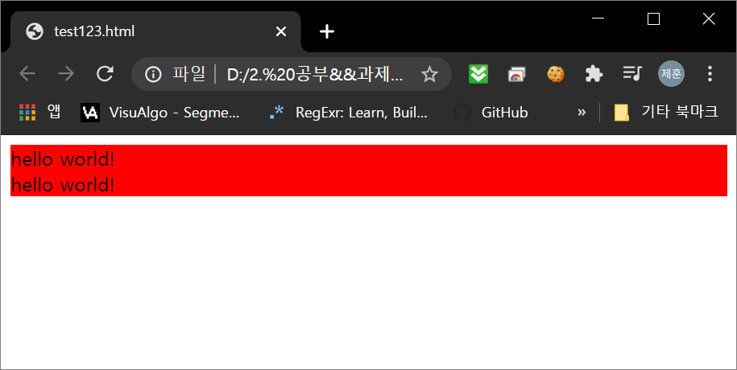

### 2. 래퍼 <span style="font-size : medium"> Wrapper</span>

jQuery를 사용 할 때 그 사용된 라인은 모두 자기자신(jQuery)를 리턴한다. 이 때 `$`를 사용하면 문제가 생긴다.

`$` 는 기본적으로 javascript 에서 의미를 가지지 않는 문자열들 중 1개이다. 하지만 다른 이 `$` 는 jquery에서만 사용하는 것이 아니기 때문에 `$` 사용시 다른 라이브러리와 충돌이 발생 할 수 있다.

#### 1. jQuery.(element).method() 사용

`$` 의 사용은 다른 라이브러리의 충돌을 발생시킬 수 있으므로 `$` 대신 **`jQuery` 를 사용**하면 이러한 충돌을 방지할 수 있다.

```html
<script type="text/javascript">
  jQeury.html('hello world');
</script>
```
하지만 이러한 방식은 `$` 라는 간단한 코드대신 `jQuery`를 써야 하므로 코드가 길어진다.
이러한 방식 대신 밑의 방식을 권장한다.

#### 2. 함수의 지역변수로써 $ 사용

`$` 의 사용이 다른 라이브러리의 충돌을 유발하는 것은 `$` 가 전역변수로 사용되었을 때 일어난다. 이러한 문제는 이 `$`를 **함수의 지역변수로 사용**하면 해결이 가능하다.

```html
<script type="text/javascript">
  (function($){
    //jQuery 코드가 위치함
    $('body').html('hello world')
  })(jQuery)
</script>
```

위의 소스는 즉시실행 함수이다. 이를 통해 `jQuery`를 인자로 전달하였기 때문에 `$` 는 저 함수안의 지역변수가 되었다. 이를 통해 `$`를 안전하게 사용할 수 있다.

### 3. 선택자<span style="font-size : medium"> Selector</span>

선택자는 기본적으로 css 에서 접근하는 선택자와 동일하게 동작하므로 생략한다.
선택자에 대한 모든 방법, 문법은 밑의 공식 사이트를 참조하라

[jQuery Selector 공식 문서](https://api.jquery.com/category/selectors/)

### 4. Chain

jQuery Chain 은 jQuery 가 사용될 때 그 리턴값은 jQuery로 Warpping 되어 리턴된다.

```html
<html>
    <body>
        <a id="tutorial" href="http://jquery.com" target="_self">jQuery</a>
        <script type="text/javascript" src="https://ajax.googleapis.com/ajax/libs/jquery/1.6.2/jquery.min.js"></script>
        <script type="text/javascript">
            jQuery('#tutorial').attr('href', 'http://jquery.org').attr('target', '_blank').css('color', 'red');
        </script>
    </body>
</html>
```

위의 소스에서 jQuery 부분에 연속적으로 메소드를 사용하였다.
```html
<script type="text/javascript">
    jQuery('#tutorial').attr('href', 'http://jquery.org').attr('target', '_blank').css('color', 'red');
</script>
```
여기서 연속적으로 `attr`, `attr`, `css` 메소드를 쓸 수 있는 이유도 각각의 메소드의 리턴값이 자기 자신이기 때문에 연속적으로 메소드를 사용할 수 있는 것이다. 이를 **jQuery Chain** 이라고 한다. 이러한 기능은 순수한 javascript 소스를 보면 더 자명하게 나타난다.

```html
<html>
     <body>
         <a id="tutorial" href="http://jquery.com" target="_self">jQuery</a>
         <script type="text/javascript">
             var tutorial = document.getElementById('tutorial');
             tutorial.setAttribute('href', 'http://jquery.org');
             tutorial.setAttribute('target', '_blank');
             tutorial.style.color = 'red';
         </script>
     </body>
 </html>
```

javascript 에서 `setAttribute`는 jQuery에 `attr`의 기능과 같다. 이제 소스를 살펴보자. 위의 소스는 jQuery를 사용한 소스와 완전히 동일하게 동작한다. 이 때 javascript 에 비해 jQuery는 **소스의 길이가 짧고**, **사람의 사고와 비슷하여 이해하기가 쉽다**.

### 5. 탐색<span style="font-size : medium"> Traversing</span>

탐색은 jQuery Chain 을 초기화하거나 컨트롤하기 위해 사용된다. 밑의 소스로 알아보자

<span style = "font-size:small">**[SOURCE]**</span>

```html
<html>
    <body>
        <ul class="first">
            <li class="foo"> list item 1 </li>
            <li> list item 2 </li>
            <li class="bar"> list item 3 </li>
        </ul>
        <ul class="second">
            <li class="foo"> list item 1 </li>
            <li> list item 2 </li>
            <li class="bar"> list item 3 </li>
        </ul>
        <script type="text/javascript"
        src="https://ajax.googleapis.com/ajax/libs/jquery/1.6.2/jquery.min.js"></script>
        <script type="text/javascript">
        $('ul.first').find('.foo').css('background-color', 'red')
        .end().find('.bar').css('background-color', 'green');
      </script>
    </body>
</html>
```

<span style = "font-size:small">**[BROWSER]**</span>

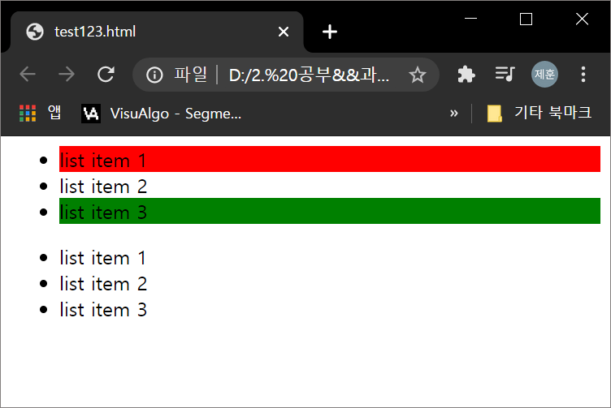

jQuery의 소스만 따로 해석해 보자

```javascript
$('ul.first').find('.foo').css('background-color', 'red')
.end().find('.bar').css('background-color', 'green');
```

여기서 `ul.first` 는 `ul` 태그에 `first` 클래스 전체를 지정한다. 이후 `find('.foo')` 를 하게 되면 `first` 클래스 안의 `foo` 라는 클래스만 지정하게 된다. 이후 css 속성으로 배경색을 red로 지정했으므로 `list item 1` 만 빨간색이 된다. 이후 `end()`를 사용하면 마지막으로 사용한 travers 즉 jQuery 실행 했던 때의 선택자 `'ul.first'` 를 가리키게 된다. 그리고 `find('.bar')` 를 했으므로 `bar` 클래스를 지정한다. 이후 css 속성으로 배경색을 green 으로 바꾸어서 위의 사진과 같은 결과창이 나오는 것이다. 이렇게  지정방식의 전환을 **traversing, 한글로는 탐색** 이라고 한다.

traversing 에 관련된 api 들은 밑의 jQuery 공식 홈페이지를 참조하라

[jQuery Traversing 공식 페이지](https://api.jquery.com/category/traversing/)

### 6. 이벤트<span style="font-size : medium"> Event</span>

jQuery에서 이벤트는 시스템에서 일어나는 사건을 컨트롤 해 준다. 기존의 javascript 로 이벤트를 작성하면 브라우저간의 호환성 문제가 생겨서 브라우저마다 따로 작성을 해 주어야 하지만 jQuery는 모든 브라우저에 하나의 코드로 적용이 가능하다.

#### 1. bind, unbind, trigger

<span style = "font-size:small">**[SOURCE]**</span>

```html
<html>
    <head>
        <script type="text/javascript" src="https://ajax.googleapis.com/ajax/libs/jquery/1.6.2/jquery.min.js"></script>
        <script type="text/javascript">
            function clickHandler(e){
                alert('thank you');
            }
            $(document).bind('ready', function(){
                 $('#click_me').bind('click', clickHandler);
                 $('#remove_event').bind('click', function(e){
                     $('#click_me').unbind('click', clickHandler);
                 });
                 $('#trigger_event').bind('click', function(e){
                     $('#click_me').trigger('click');
                 });
             })
        </script>
    </head>
    <body>
        <input id="click_me" type="button" value="click me" />
        <input id="remove_event" type="button" value="unbind" />
        <input id="trigger_event" type="button" value="trigger" />
    </body>
</html>
```

<span style = "font-size:small">**[BROWSER]**</span>

<link rel="stylesheet" href="jqueryStudyBySHCD.css">

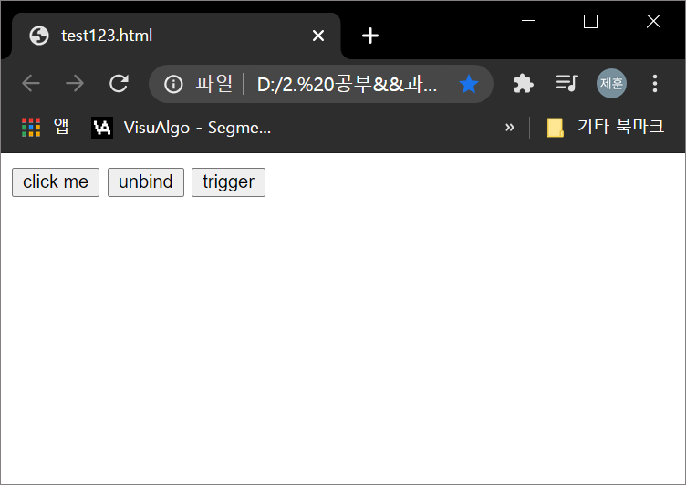
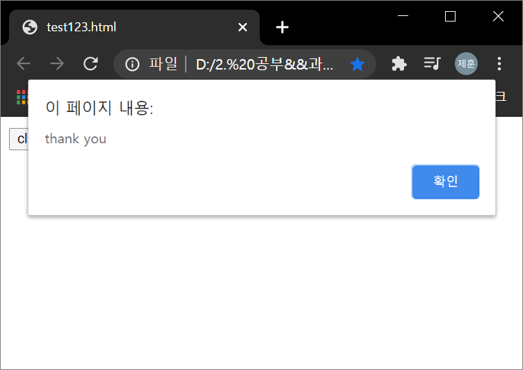


위에서 jquery 소스만 자세히 보자

```javascript
function clickHandler(e){
    alert('thank you');
}
$(document).bind('ready', function(){
   $('#click_me').bind('click', clickHandler);
   $('#remove_event').bind('click', function(e){
       $('#click_me').unbind('click', clickHandler);
   });
   $('#trigger_event').bind('click', function(e){
       $('#click_me').trigger('click');
   });
})
```
`$(document).bind('ready', function()` 부분에서 `'ready'` 는 전체 코드에서 script 코드가 button 이 선언되기 전에 사용되었기 때문에 전체 코드가 안착할 때까지 기다린 후에 실행하기 위한 기능이다. **`bind`** 메소드는 **이벤트 핸들러를 설치하는 기능**이다. 여기서 마우스 클릭을 하면 `clickHandler`라는 함수를 실행하도록 하는 이벤트를 작성했다. **`unbind`** 는 **이벤트 핸들러를 종료**하는 메소드인데 여기서 `$('#click_me').unbind('click', clickHandler);` 부분에서 `click`과 `clickHandler`를 정확히 명시하여 `unbind`할 메소드를 정확히 지정해 주어야 한다. **`trigger`** 는 **이벤트를 강제로 실행**하는 메소드이다. 위의 소스 `$('#click_me').trigger('click');` 이 부분에서 `click_me` 라고 하는 아이디가 가지고 있는 이벤트 중 `click` 이라는 이벤트를 강제로 실행하게 된다.

```javascript
function clickHandler(e){
      alert('thank you');
  }
$(document).ready(function(){
     $('#click_me').click(clickHandler);
     $('#remove_event').click(function(e){
         $('#click_me').unbind('click', clickHandler);
     });
     $('#trigger_event').click(function(e){
         $('#click_me').trigger('click');
     });
 })
```

위에서 $(document).ready(function(){ 이런식으로 ready라는 이벤트 헬퍼를 사용할 수 있다. 이 방식이 더 많이 쓰이니 알아두자.

#### 2. live, die

```javascript
<html>
    <head>
        <script type="text/javascript" src="https://ajax.googleapis.com/ajax/libs/jquery/1.6.2/jquery.min.js"></script>
        <script type="text/javascript">
            function clickHandler(e) {
                alert('thank you');
            }
            $('#click_me').live('click', clickHandler);
            $('#remove_event').live('click', function(e) {
                $('#click_me').die('click', clickHandler);
            });
            $('#trigger_event').live('click', function(e) {
                $('#click_me').trigger('click');
            });
        </script>
    </head>
    <body>
        <input id="click_me" type="button" value="click me" />
    <input id="remove_event" type="button" value="unbind" />
    <input id="trigger_event" type="button" value="trigger" />
    </body>
</html>
```
위의 소스는 3.6.1 의 소스와 기능은 완전히 동일하다. `live` 메소드는 기본적으로 `bind`와 비슷하게 동작하나 타겟 엘리먼트가 존재하지 않아도 선언할 수 있다. 즉 선언을 하고 나중에 그 엘리먼트가 선언되면 사용하는 식으로 동작한다. 즉 `ready`와 `bind` 를 같이 쓴 기능을 `live`는 혼자서 수행할 수 있다. `live`를 쓸지 `bind`를 쓸지는 사용자가 판단하면 된다. 단 `unbind` 는 `die` 메소드를 사용하여야 한다.

이벤트 핸들러와 관련된 정확하고 자세한 정보는 공식사이트를 참조하라

[jQuery 공식 페이지-Event Handler Attatchment](https://api.jquery.com/category/events/event-handler-attachment/)

### 7. 엘리먼트의 조작 manipulation

javascript 자체에서 엘리먼트를 조작할 수 있으나 jquery의 메소드에 비해 생산성이 떨어진다. jquery의 엘리먼트 조작 메소드들을 알아보자

#### 1. append()

append는 타깃 엘리먼트의 자식으로 요소를 추가시키는 메소드이다.

<span style = "font-size:small">**[SOURCE]**</span>

```html
<!DOCTYPE html>
<html>
    <head>
        <style>
            p {
                background:yellow;
            }
        </style>
        <script src="http://code.jquery.com/jquery-latest.js"></script>
    </head>
    <body>
        <p>
            I would like to say:
        </p>
        <script>$("p").append("<strong>Hello</strong>");</script>
    </body>
</html>
```

<span style = "font-size:small">**[BROWSER]**</span>

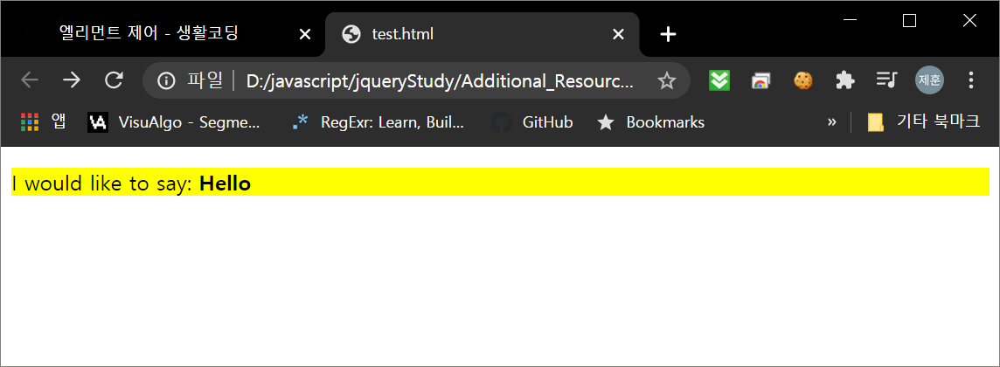

#### 2. after()

after는 타깃 엘리먼트의 형제로 요소를 추가하는 메소드이다.

<span style = "font-size:small">**[SOURCE]**</span>

```html
<!DOCTYPE html>
<html>
    <head>
        <style>
            p {
                background:yellow;
            }
        </style>
        <script src="http://code.jquery.com/jquery-latest.js"></script>
    </head>
    <body>
        <p>
            I would like to say:
        </p>
        <script>$("p").after("<strong>Hello</strong>");</script>
    </body>
</html>
```

<span style = "font-size:small">**[BROWSER]**</span>

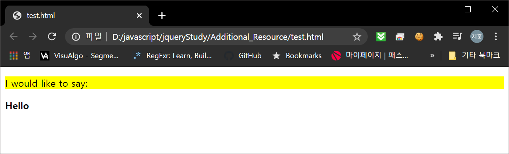

#### 3. wrap()

wrap 은 타깃 엘리먼트를 내가 지정한 태그들로 감싸는 메소드이다

<span style = "font-size:small">**[SOURCE]**</span>

```html
<!DOCTYPE html>
<html>
    <head>
        <style>
            div {
                border:2px blue solid;
                margin:2px;
                padding:2px;
            }
            p {
                background:yellow;
                margin:2px;
                padding:2px;
            }
            strong {
                color:red;
            }
        </style>
        <script src="http://code.jquery.com/jquery-latest.js"></script>
    </head>
    <body>
        <span>Span Text</span>
        <strong>What about me?</strong>
        <span>Another One</span>
        <script>$("span").wrap("<div><div><p><em><b></b></em></p></div></div>");</script>
    </body>
</html>
```

<span style = "font-size:small">**[BROWSER]**</span>

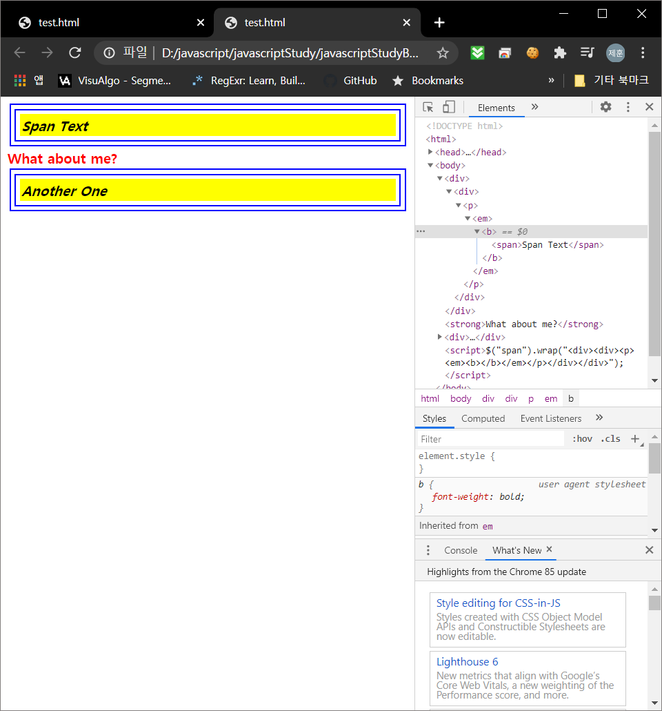

#### 4. remove()

remove 는 타깃엘리먼트를 모두 삭제하는 메소드이다.

<span style = "font-size:small">**[SOURCE]**</span>

```html
<!DOCTYPE html>
<html>
    <head>
        <style>
            p {
                background:yellow;
                margin:6px 0;
            }
        </style>
        <script src="http://code.jquery.com/jquery-latest.js"></script>
    </head>
    <body>
        <p>
            Hello
        </p>
        how are
        <p>
            you?
        </p>
        <button>
            Call remove() on paragraphs
        </button>
        <script>
            $("button").click( function () {
                $("p").remove();
            });
        </script>
    </body>
</html>
```

<span style = "font-size:small">**[BROWSER-버튼클릭 전]**</span>

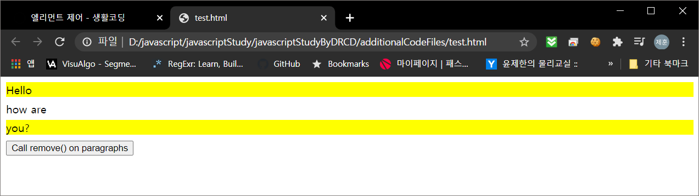

<span style = "font-size:small">**[BROWSER-버튼클릭 후]**</span>

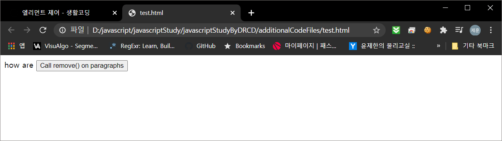


#### 5. replaceAll()

replaceAll은 `$(emt).replaceAll(target)` 에서 ``target`` 엘리먼트를 찾아서 `emt` 로 대체한다.

<span style = "font-size:small">**[SOURCE]**</span>

```html
<!DOCTYPE html>
<!DOCTYPE html>
<html>
    <head>
        <script src="http://code.jquery.com/jquery-latest.js"></script>
    </head>
    <body>
        <p> Hello </p>
        <p> cruel </p>
        <p> World </p>
        <script>
        $("<b>Paragraph. </b>").replaceAll("p"); // check replaceWith() examples
        </script>
    </body>
</html>
```

<span style = "font-size:small">**[BROWSER]**</span>

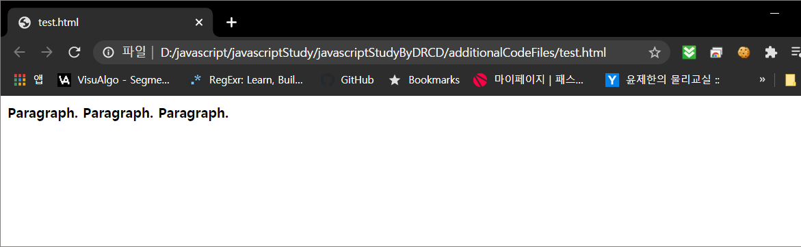

#### 6. toggleClass()

toggleClass 는 타깃엘리먼트(태그)가 클래스를 가지고 있으면 클래스를 제거, 클래스를 가지고 있지 않으면 클래스를 삽입한다.

<span style = "font-size:small">**[SOURCE]**</span>

```html
<!DOCTYPE html>
<html>
    <head>
        <style>p {
                margin: 4px;
                font-size:16px;
                font-weight:bolder;
                cursor:pointer;
            }
            .blue {
                color:blue;
            }
            .highlight {
                background:yellow;
            }
        </style>
        <script src="http://code.jquery.com/jquery-latest.js"></script>
    </head>
    <body>
        <p class="blue"> Click to toggle </p>
        <p class="blue highlight"> highlight </p>
        <p class="blue"> on these </p>
        <p class="blue"> paragraphs </p>
        <script>
             $("p").click( function () {
                 $(this).toggleClass("highlight");
             });
         </script>
    </body>
</html>
```

<span style = "font-size:small">**[BROWSER]**</span>

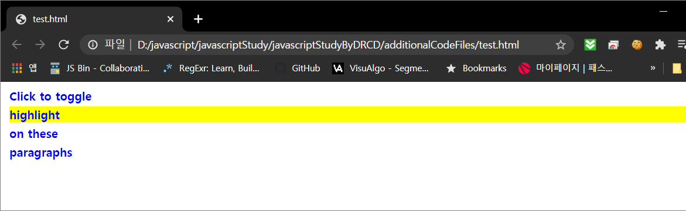

위에서 대표적인 엘리먼트 제어를 배워보았다. 이 제어메소드는 공식사이트에서 참고하며 사용하라.

[jquery manipulation 공식 문서](https://api.jquery.com/category/manipulation/)
